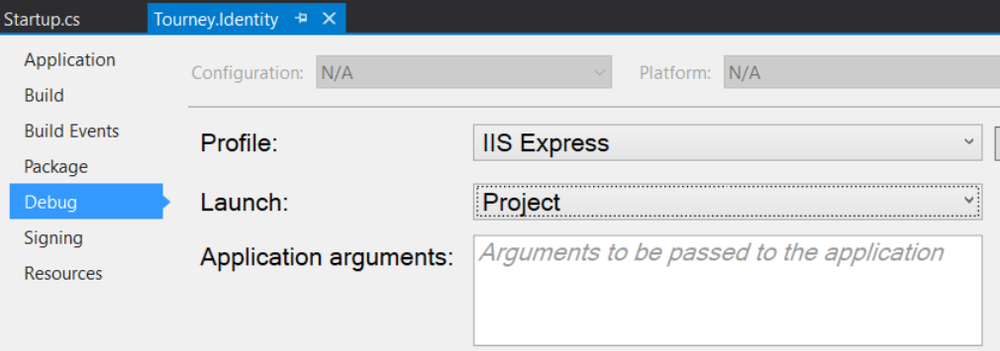

# Identity Server 4 Sample using Azure AD

Sample web application secured by a single sign-on app using [Identity Server 4](https://github.com/IdentityServer/IdentityServer4). Web application is a SPA that uses a Web API to get its data.

Identity Server 4 is follows the [Open Id Connect](http://openid.net/connect/) standard.

## Requirements

- NodeJS
- ASP.Net Core

## Overview 


### Project Structure:
- **Tourney.Identity** - Single sign-on web app
    - ASP.NET Core using .NET core and Identity Server 4
    - It uses MVC for the front-end.
    - _Needs to run at http://localhost:5000_
- **Tourney.App** - Front-end built using Angular 2 and Typescript
    - You should have to log in to view data in "Facilities" tab
    - _Needs to run at http://localhost:5003_
- **Tourney.Web** - API using ASP.NET Core and .NET Core
    - Azure AD settings are managed via [Secrets Manager](https://docs.microsoft.com/en-us/aspnet/core/security/app-secrets) package
    - _Needs to run at http://localhost:5001"_

## Getting Started 

Download [NodeJS](https://nodejs.org/en/)
Download [ASP.NET Core](https://www.asp.net/core)

### Running `Tourney.App`
 
From Tourney.App directory, download the NPM packages 
```
npm install
```
Then run the app using:
```
 ng serve --port 5003
```

### Running `Tourney.Web` and `Tourney.Identity` server

Using Visual Studio, set up multiple start up projects. 

Make sure that you're not using IIS Express or the ports will be auto-assigned. From the project settings, specify to debug as **Project**



